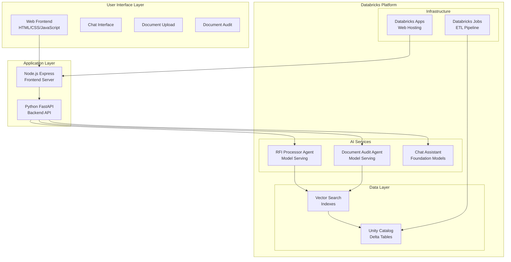

# 🎯 ARIA: Analyst Relations Intelligent Assistant


**AI-powered RFP response generation and document analysis platform built on Databricks**

ARIA streamlines analyst relations workflows by leveraging large language models to extract questions from RFP documents, generate contextual responses, and provide intelligent document auditing capabilities. Built on Databricks with Unity Catalog, Vector Search, and Model Serving, ARIA provides a complete end-to-end solution for automating analyst relations processes while maintaining quality and brand consistency.

The platform combines retrieval-augmented generation (RAG) with custom AI agents to deliver accurate, contextual responses based on your organization's knowledge base, product documentation, and brand guidelines. ARIA transforms the traditionally manual and time-intensive RFP response process into an efficient, scalable, and intelligent workflow.

---

## Table of Contents

- [Features & Use Cases](#features--use-cases)
- [How to Deploy and Test ARIA](#how-to-deploy-and-test-aria)
- [How to Customize ARIA to Your Data](#how-to-customize-aria-to-your-data)
- [System Architecture & Dependencies](#system-architecture--dependencies)
- [Configuration Details](#configuration-details)
- [Analytics & Monitoring](#analytics--monitoring)
- [Advanced Configuration](#advanced-configuration)
- [Additional Resources](#additional-resources)

---

## 🚀 **Features & Use Cases**

### 📋 **RFP Processing Pipeline**
- **Smart Question Extraction**: AI-powered parsing of CSV and HTML RFP documents
- **Intelligent Answer Generation**: Contextual responses using company knowledge base
- **Multi-format Export**: Results available in HTML, CSV, or clipboard-ready formats
- **Progress Tracking**: Real-time processing status with detailed analytics

### 💬 **AI Chat Assistant**
- **Knowledge Base Access**: Query curated responses from prior RFI/RFP submissions
- **Technical Documentation**: Access to Databricks and open source project docs
- **Ad-hoc Questions**: Get instant answers for analyst relations queries
- **Conversation History**: Maintain context across chat sessions

### 🔍 **Document Auditing**
- **Content Analysis**: Identify factual accuracy issues and tone inconsistencies
- **Messaging Alignment**: Ensure responses align with company positioning
- **Visual Annotations**: Highlighted concerns with detailed explanations
- **Audit Reports**: Exportable audit results for compliance and review

---

## 🚀 **How to Deploy and Test ARIA**

### Prerequisites

- **Databricks CLI** installed and configured ([Installation Guide](https://docs.databricks.com/dev-tools/cli/install.html))
- **Databricks Asset Bundle (DAB)** permissions ([Learn about DABs](https://docs.databricks.com/dev-tools/bundles/index.html))
- Access to Databricks workspace with permissions for:
  - Model Serving
  - Jobs
  - Apps
  - Unity Catalog
  - Vector Search

### One-Click Deployment

```bash
# 1. Install Databricks CLI
curl -fsSL https://raw.githubusercontent.com/databricks/setup-cli/main/install.sh | sh

# 2. Configure CLI with your workspace
databricks configure

# 3. Clone and navigate to ARIA
git clone <repository-url>
cd aria

# 4. Validate configuration
databricks bundle validate --target development

# 5. Deploy infrastructure
databricks bundle deploy --target development

# 6. 🎯 Complete setup (One command does everything!)
databricks bundle run aria-complete-setup --target development
```

**That's it!** The `aria-complete-setup` job handles everything:
- ✅ ETL pipeline (data processing)
- ✅ Vector search indexes
- ✅ AI agent deployment
- ✅ Model serving endpoints
- ✅ Ready-to-use ARIA system

### Verify Deployment

```bash
# Check app status
databricks apps status aria-web-app --target development

# Access your ARIA application
# URL will be provided in the deployment output
```

**Resources:**
- [Databricks CLI Documentation](https://docs.databricks.com/dev-tools/cli/index.html)
- [Databricks Asset Bundles Guide](https://docs.databricks.com/dev-tools/bundles/index.html)
- [Model Serving Documentation](https://docs.databricks.com/machine-learning/model-serving/index.html)

---

## 📊 **How to Customize ARIA to Your Data**

> **⚠️ TECHNICAL EXPERTISE REQUIRED**  
> **A technical professional such as a data engineer, data scientist, or Databricks solution architect is needed to successfully apply the ARIA solution to your custom data sources.**

### Understanding ARIA as a Template

ARIA is designed as a **comprehensive template** with all the infrastructure pieces in place. You can think of it as a framework where you drop in your specific data and customizations to create a tailored analyst relations solution.

### Demo Data Sources

The demo includes four key datasets that demonstrate the complete pipeline:

1. **RFI Q&A Dataset** (`databricks_qa_dataset.csv`) - Historical question-answer pairs from analyst questionnaires
2. **Product Documentation** (`dbdocs.csv`) - Databricks product documentation and technical specs  
3. **Product Keywords** (`product_keyword_mappings.csv`) - Product categorization and keyword mappings
4. **Blog Content** (`databricks_blogs.csv`) - Company blog posts and thought leadership content

### Data Pipeline Architecture

```
Your Raw Data → Delta Lake Tables → Vector Search Indexes → AI Agents → Model Serving
```

1. **ETL Processing**: Raw data (CSV, PDFs, web scraping) → Unity Catalog Delta tables
2. **Vector Indexing**: Text content → Vector Search indexes for semantic retrieval
3. **Agent Training**: RAG agents built on top of vector indexes with custom prompts
4. **Model Serving**: Deployed agents accessible via REST APIs and web interface

### Bringing Your Own Data

**Supported Data Sources:**
- CSV files with Q&A pairs
- PDF documents (product specs, whitepapers)
- Web scraped content (blogs, documentation)
- HTML documents (RFPs, questionnaires)
- Any structured text data

**Schema Requirements:**
Your data tables must match the schema patterns in the demo:
- **Q&A Data**: `question`, `answer`, `topic` columns
- **Documentation**: `text`, `url`, `title` columns  
- **Keywords**: `product_name`, `keywords`, `description` columns

**Customization Benefits:**
- **Product Messaging**: Replace demo messaging with your actual product positioning
- **Brand Guidelines**: Incorporate your company's voice, tone, and style requirements
- **Domain Knowledge**: Add your specific industry terminology and technical details
- **Compliance**: Include regulatory requirements and approval workflows

### Implementation Steps

1. **Replace Sample Data**: Substitute demo CSV files with your data sources
2. **Update ETL Notebooks**: Modify data processing logic for your schema
3. **Customize Prompts**: Update agent prompts with your messaging and guidelines
4. **Configure Models**: Adjust model parameters and serving configurations
5. **Test & Validate**: Run the complete setup with your data

The modular design means you can customize individual components while leveraging the proven infrastructure and AI capabilities.

---

## 🏗️ **System Architecture & Dependencies**

### High-Level Architecture



### Technology Stack

**Frontend:**
- **Node.js 18+** - Frontend server and build system
- **Express.js** - Web application framework
- **Vanilla JavaScript** - Client-side interactions (no framework dependencies)
- **HTML5/CSS3** - Modern responsive design

**Backend:**
- **Python 3.9+** - Core application language
- **FastAPI** - High-performance async API framework
- **Pydantic** - Data validation and settings management
- **Uvicorn** - ASGI server for production deployment

**AI & ML:**
- **Databricks Model Serving** - AI agent deployment and inference
- **Vector Search** - Semantic similarity and retrieval
- **Unity Catalog** - Data governance and model registry
- **DSPy** - LLM application framework
- **MLflow** - Model lifecycle management

**Data & Infrastructure:**
- **Delta Lake** - Data storage and versioning
- **Apache Spark** - Distributed data processing
- **Databricks Jobs** - Workflow orchestration
- **Databricks Apps** - Web application hosting

### Codebase Organization

```
aria/
├── app/                          # Web Application
│   ├── src/aria/                # Python backend
│   │   ├── api/                 # FastAPI endpoints
│   │   ├── config/              # Configuration management
│   │   ├── core/                # Core utilities & logging
│   │   ├── services/            # Business logic services
│   │   └── utils/               # Helper functions
│   ├── static/                  # Frontend assets (HTML/CSS/JS)
│   ├── tests/                   # Web app tests
│   └── requirements.txt         # Web app dependencies
├── src/                         # Databricks Jobs & Notebooks
│   └── aria/notebooks/          
│       ├── agents/              # AI agent notebooks
│       ├── etl/                 # Data processing notebooks
│       └── evaluation/          # Model evaluation notebooks
├── sample_data/                 # Demo datasets
├── databricks.yml               # DAB configuration
└── requirements.txt             # Notebook dependencies
```

### Running Locally

**Prerequisites:** Complete Databricks deployment first (ETL, models, endpoints)

```bash
# 1. Install dependencies
cd app
npm install
pip install -r requirements.txt

# 2. Configure environment
cp ../env.example .env
# Edit .env with your Databricks workspace details

# 3. Start development server
npm run dev
```

**Local Development URLs:**
- Frontend: http://localhost:3000
- Backend API: http://localhost:8080
- API Documentation: http://localhost:8080/docs

### Testing

```bash
# Unit tests
cd app
python -m pytest tests/unit/ -v

# Integration tests  
python -m pytest tests/integration/ -v

# Test coverage
python -m pytest --cov=aria tests/ --cov-report=html
```

**Test Organization:**
- **Unit Tests**: Individual service and utility testing
- **Integration Tests**: End-to-end workflow validation
- **Mock Services**: Databricks SDK and external API mocking

---

## ⚙️ **Configuration Details**

### Environment Variables

**Core Application Settings:**
```bash
# Databricks Connection
DATABRICKS_HOST=https://your-workspace.cloud.databricks.com
DATABRICKS_TOKEN=your-personal-access-token
DATABRICKS_WAREHOUSE_ID=your-sql-warehouse-id

# Model Configuration
QUESTION_EXTRACTION_MODEL=databricks-claude-sonnet-4
ANSWER_GENERATION_MODEL=agents_users-your_schema-auto_rfi
DOCUMENT_AUDIT_MODEL=agents_users-your_schema-audit_agent

# Performance Settings
MAX_TOKENS=4000
TIMEOUT_SECONDS=300
MAX_FILE_SIZE_MB=10
```

### Backend Services Configuration

**File:** `app/src/aria/config/backend_services.yaml`

```yaml
# Model Endpoints
question_extraction:
  model: "databricks-claude-sonnet-4"
  max_tokens: 4000
  temperature: 0.1

answer_generation:
  model: "agents_users-rafi_kurlansik-auto_rfi"
  max_tokens: 8000
  temperature: 0.3

# Vector Search
vector_search:
  endpoint: "one-env-shared-endpoint-2"
  
# Unity Catalog
analytics:
  unity_catalog:
    catalog: "users"
    schema: "rafi_kurlansik"
```

### DAB Parameters

**File:** `databricks.yml` - Variables section

```yaml
variables:
  catalog_name:
    description: "Unity Catalog name for ARIA data"
    default: "users"
  
  schema_name:
    description: "Schema name for ARIA tables"
    default: "${workspace.current_user.userName}"
  
  vector_search_endpoint:
    description: "Vector search endpoint name"
    default: "one-env-shared-endpoint-2"
```

### Application Constants

**File:** `app/src/aria/config/constants.py`

```python
# File Processing
SUPPORTED_FILE_TYPES = [".csv", ".html", ".htm"]
MAX_FILE_SIZE_MB = 10
DEFAULT_TIMEOUT_SECONDS = 300

# AI Model Settings
DEFAULT_EXTRACTION_PROMPT = "Extract questions from this document..."
MAX_TOKENS_DEFAULT = 4000
TEMPERATURE_DEFAULT = 0.3

# Audit Categories
AUDIT_CATEGORIES = [
    "factual_accuracy",
    "messaging_alignment", 
    "tone_consistency",
    "completeness"
]
```

### Customization Points

**Model Parameters:**
- Token limits: Adjust `max_tokens` in service configs
- Temperature: Control randomness in model responses
- Timeout values: Configure request timeout limits

**Prompt Engineering:**
- **RFI Processor**: `src/aria/notebooks/agents/rfi_processor.py`
- **Audit Agent**: `src/aria/notebooks/agents/audit_agent.py`
- **Product Messaging**: Update `product_messaging` variable
- **Brand Guidelines**: Update `brand_guidelines` variable

**Data Processing:**
- **ETL Parameters**: Modify notebook widgets in `src/aria/notebooks/etl/`
- **Vector Index Settings**: Configure in `src/aria/notebooks/agents/rag/01_create_vs_idx.py`
- **Schema Mappings**: Update table schemas in ETL notebooks

---

## 📈 **Analytics & Monitoring**

### Built-in Analytics

ARIA includes comprehensive analytics tracking across the entire workflow:

**Question-Level Metrics:**
- Processing success rates and completion times
- Model response quality and accuracy scores
- User interaction patterns and regeneration requests
- Error analysis and failure categorization

**Business KPIs:**
- RFP processing throughput and efficiency gains
- Response quality improvements over time
- User adoption and engagement metrics
- Cost optimization and resource utilization

**Performance Monitoring:**
- Model inference latency and throughput
- Vector search query performance
- API response times and error rates
- Resource utilization and scaling metrics

### Analytics Tables

All analytics data is stored in Unity Catalog for easy querying and visualization:

```sql
-- Example analytics queries
SELECT * FROM users.your_schema.rfi_extractions;
SELECT * FROM users.your_schema.rfi_generation_batches;
SELECT * FROM users.your_schema.chat_sessions;
```

### Model Evaluation

For comprehensive model evaluation and quality assessment, see the detailed evaluation framework:

**📊 [ARIA Evaluation Framework](docs/ARIA_evaluation.md)**

This document covers:
- Model performance benchmarking
- Response quality metrics
- A/B testing methodologies
- Continuous improvement strategies

### Monitoring Dashboards

**Databricks SQL Dashboards:**
- Real-time processing metrics
- Model performance trends
- User engagement analytics
- Cost and resource optimization

**Custom Analytics:**
- Export data to your preferred BI tools
- Integration with existing monitoring systems
- Custom alerting and notification workflows

---


## 🔧 **Advanced Configuration**

### Custom Model Integration

**Adding New Models:**
1. Register model in Unity Catalog
2. Update `backend_services.yaml` configuration
3. Modify service classes in `app/src/aria/services/`
4. Deploy via DAB or manual endpoint creation

**Model Serving Configuration:**
```python
# Example custom model configuration
custom_model_config = {
    "name": "custom-analyst-model",
    "endpoint": "custom-endpoint-name",
    "max_tokens": 6000,
    "temperature": 0.2
}
```

### Data Source Integration

**Adding New Data Sources:**
1. Create ETL notebook in `src/aria/notebooks/etl/`
2. Define Unity Catalog table schema
3. Add vector search index configuration
4. Update agent retrieval logic

**Schema Requirements:**
- Consistent column naming conventions
- Required metadata fields (id, timestamp, source)
- Text content optimization for vector search

### Security & Compliance

**Data Governance:**
- Unity Catalog access controls
- Row-level and column-level security
- Audit logging and compliance tracking
- Data lineage and impact analysis

**Model Security:**
- Endpoint authentication and authorization
- Rate limiting and usage monitoring
- Content filtering and safety checks
- Privacy-preserving inference options

---

## 📚 **Additional Resources**

### Documentation
- [Databricks Asset Bundles](https://docs.databricks.com/dev-tools/bundles/index.html)
- [Model Serving Guide](https://docs.databricks.com/machine-learning/model-serving/index.html)
- [Vector Search Documentation](https://docs.databricks.com/generative-ai/vector-search.html)
- [Unity Catalog Guide](https://docs.databricks.com/data-governance/unity-catalog/index.html)

### Support & Community
- [Databricks Community](https://community.databricks.com/)
- [MLflow Documentation](https://mlflow.org/docs/latest/index.html)
- [FastAPI Documentation](https://fastapi.tiangolo.com/)

### License & Contributing
This project is licensed under the MIT License. Contributions are welcome! Please see our contributing guidelines for more information.

---

**Built with ❤️ on Databricks**
