# ARIA Analytics System Documentation

## Overview

The ARIA analytics system provides comprehensive tracking of user interactions and system performance across question extraction, answer generation, and chat functionality. The system uses **batch-level tracking** to provide accurate business KPIs while maintaining detailed performance insights.

### Key Features

- 🎯 **Business KPI Accuracy**: Proper deduplication handling for regeneration scenarios
- 📊 **Batch-Level Tracking**: Each topic/batch of questions tracked as a unit  
- 📊 **STRUCT/ARRAY Format**: No JSON blobs - fully navigable data in Databricks Catalog Explorer
- 🔄 **Session Management**: Automatic session versioning for regeneration scenarios
- 📈 **Multi-dimensional Analysis**: Business KPIs, UX metrics, and performance analytics

## Architecture

### Data Flow

```
User Action → API Endpoint → Service Layer → Analytics Service → Delta Tables
```

### System Flow Diagram

```mermaid
graph TD
    A[User Upload Document] --> B[Question Extraction Service]
    B --> C[rfi_extractions Table]
    B --> D[Question Generation Service]
    
    D --> E[Batch Processing by Topic]
    E --> F[rfi_generation_batches Table]
    
    F --> G[Export Service]
    G --> H[rfi_exports Table]
    
    I[User Chat Input] --> J[Chat Service]
    J --> K[chat_questions Table]
    
    L[Analytics Service] --> C
    L --> F
    L --> H
    L --> K
    
    M[Databricks Catalog Explorer] --> C
    M --> F
    M --> H
    M --> K
    
    subgraph "STRUCT/ARRAY Benefits"
        N["✅ Navigable Data<br/>✅ No JSON Blobs<br/>✅ SQL Queryable<br/>✅ Type Safety"]
    end
    
    subgraph "Business KPIs"
        O["📊 Questions Answered per Batch<br/>📈 Success Rates<br/>📉 Completion Rates<br/>⏱️ Processing Times"]
    end
    
    M --> N
    F --> O
    
    style A fill:#e1f5fe
    style C fill:#f3e5f5
    style F fill:#f3e5f5
    style H fill:#f3e5f5
    style K fill:#f3e5f5
    style N fill:#e8f5e8
    style O fill:#fff3e0
```



### Analytics Approach

**Batch-Level Tracking**
- **Efficient**: Each topic/batch processed and tracked as a unit in `rfi_generation_batches`
- **Complete**: All questions and answers captured per batch with full context
- **Versioned**: Session versioning for regenerations managed through explicit user actions
- **Business KPIs**: Aggregate from batch data for accurate counts

## Table Schema

### Core Tables

#### 1. `rfi_extractions` - Question Extraction Events
```sql
CREATE TABLE rfi_extractions (
    event_id STRING NOT NULL,
    user_id STRING,
    session_id STRING,
    timestamp TIMESTAMP NOT NULL,
    ip_address STRING,
    user_agent STRING,
    document_name STRING,
    extraction_method STRING,
    questions_extracted INT,
    model_used STRING,
    custom_prompt STRING,
    processing_time_seconds DOUBLE,
    questions ARRAY<STRUCT<
        question: STRING,
        sub_topics: ARRAY<STRUCT<
            topic: STRING,
            sub_questions: ARRAY<STRUCT<
                sub_question: STRING,
                text: STRING
            >>
        >>
    >>,
    created_at TIMESTAMP
) USING DELTA
```

#### 2. `rfi_generation_batches` - Batch Processing Events
```sql
CREATE TABLE rfi_generation_batches (
    batch_id STRING NOT NULL,
    session_id STRING NOT NULL,
    session_version INT NOT NULL,
    timestamp TIMESTAMP NOT NULL,
    user_id STRING,
    ip_address STRING,
    user_agent STRING,
    document_name STRING,
    topic_name STRING,
    batch_attempt_number INT,
    batch_status STRING,
    batch_processing_time_seconds DOUBLE,
    model_used STRING,
    custom_prompt STRING,
    questions_in_batch ARRAY<STRUCT<
        question_id: STRING,
        text: STRING,
        topic: STRING
    >>,
    answers_in_batch ARRAY<STRUCT<
        question_id: STRING,
        question_text: STRING,
        answer: STRING,
        topic: STRING,
        references: ARRAY<STRING>
    >>,
    error_message STRING,
    created_at TIMESTAMP
) USING DELTA
```

#### 3. `chat_questions` - Chat Interactions
```sql
CREATE TABLE chat_questions (
    event_id STRING NOT NULL,
    user_id STRING,
    session_id STRING,
    timestamp TIMESTAMP NOT NULL,
    ip_address STRING,
    user_agent STRING,
    chat_session_id STRING,
    question STRUCT<
        text: STRING,
        length_chars: INT
    >,
    response STRUCT<
        text: STRING,
        length_chars: INT,
        model_used: STRING,
        response_time_seconds: DOUBLE,
        copied_to_clipboard: BOOLEAN
    >,
    created_at TIMESTAMP
) USING DELTA
```

#### 4. Supporting Tables
- `rfi_uploads` - Document upload tracking
- `rfi_exports` - Export event tracking  
- `chat_sessions` - Chat session summaries

## Entity Relationship Diagram


## Sample Queries

### Business KPIs

#### Total Questions Answered Across Platform
```sql
-- Primary business metric: questions with successful answers from batch data
SELECT 
    SUM(SIZE(answers_in_batch)) as total_questions_answered,
    COUNT(DISTINCT session_id) as total_sessions,
    AVG(SIZE(answers_in_batch)::FLOAT / SIZE(questions_in_batch)) as avg_batch_success_rate
FROM users.rafi_kurlansik.rfi_generation_batches 
WHERE batch_status = 'success';
```

#### Daily Question Volume and Success Rates
```sql
SELECT 
    DATE(created_at) as date,
    COUNT(DISTINCT session_id) as sessions,
    SUM(SIZE(questions_in_batch)) as questions_attempted,
    SUM(SIZE(answers_in_batch)) as questions_answered,
    AVG(SIZE(answers_in_batch)::FLOAT / SIZE(questions_in_batch)) as success_rate
FROM users.rafi_kurlansik.rfi_generation_batches
GROUP BY DATE(created_at)
ORDER BY date DESC;
```

#### Document Performance Comparison
```sql
SELECT 
    document_name,
    COUNT(*) as batches,
    SUM(SIZE(questions_in_batch)) as total_questions,
    SUM(SIZE(answers_in_batch)) as total_answers,
    AVG(SIZE(answers_in_batch)::FLOAT / SIZE(questions_in_batch)) as success_rate,
    AVG(batch_processing_time_seconds) as avg_processing_time
FROM users.rafi_kurlansik.rfi_generation_batches
GROUP BY document_name
ORDER BY success_rate DESC;
```

### UX Metrics

#### Regeneration Patterns
```sql
-- How often do users need to regenerate answers?
SELECT 
    session_version,
    COUNT(*) as batch_count,
    COUNT(DISTINCT session_id) as unique_sessions,
    AVG(SIZE(answers_in_batch)::FLOAT / SIZE(questions_in_batch)) as success_rate
FROM users.rafi_kurlansik.rfi_generation_batches
GROUP BY session_version
ORDER BY session_version;
```

#### Topic Performance Analysis
```sql
-- Which topics are hardest to answer?
SELECT 
    topic_name,
    COUNT(*) as total_batches,
    SUM(SIZE(questions_in_batch)) as total_questions,
    SUM(SIZE(answers_in_batch)) as total_answers,
    AVG(batch_processing_time_seconds) as avg_processing_time,
    AVG(SIZE(answers_in_batch)::FLOAT / SIZE(questions_in_batch)) as success_rate
FROM users.rafi_kurlansik.rfi_generation_batches
GROUP BY topic_name
ORDER BY success_rate ASC, avg_processing_time DESC;
```

### Performance Analytics

#### Model Performance Comparison
```sql
-- Compare performance across different AI models
SELECT 
    model_used,
    COUNT(*) as total_batches,
    SUM(SIZE(questions_in_batch)) as total_questions,
    SUM(SIZE(answers_in_batch)) as total_answers,
    AVG(batch_processing_time_seconds) as avg_processing_time,
    AVG(SIZE(answers_in_batch)::FLOAT / SIZE(questions_in_batch)) as success_rate
FROM users.rafi_kurlansik.rfi_generation_batches
GROUP BY model_used
ORDER BY success_rate DESC, avg_processing_time ASC;
```

#### Processing Time Distribution
```sql
-- Understand processing time patterns
SELECT 
    CASE 
        WHEN batch_processing_time_seconds < 5 THEN '< 5 sec'
        WHEN batch_processing_time_seconds < 15 THEN '5-15 sec'
        WHEN batch_processing_time_seconds < 30 THEN '15-30 sec'
        WHEN batch_processing_time_seconds < 60 THEN '30-60 sec'
        ELSE '60+ sec'
    END as processing_time_bucket,
    COUNT(*) as batch_count,
    SUM(CASE WHEN batch_status = 'success' THEN 1 ELSE 0 END) as successful_batches,
    AVG(SIZE(answers_in_batch)::FLOAT / SIZE(questions_in_batch)) as avg_success_rate
FROM users.rafi_kurlansik.rfi_generation_batches
GROUP BY processing_time_bucket
ORDER BY 
    CASE processing_time_bucket
        WHEN '< 5 sec' THEN 1
        WHEN '5-15 sec' THEN 2
        WHEN '15-30 sec' THEN 3
        WHEN '30-60 sec' THEN 4
        ELSE 5
    END;
```

### Chat Analytics

#### Chat Usage Patterns
```sql
-- Chat interaction analysis
SELECT 
    DATE(created_at) as date,
    COUNT(*) as total_questions,
    COUNT(DISTINCT session_id) as unique_sessions,
    AVG(question.length_chars) as avg_question_length,
    AVG(response.length_chars) as avg_response_length,
    AVG(response.response_time_seconds) as avg_response_time,
    SUM(CASE WHEN response.copied_to_clipboard THEN 1 ELSE 0 END)::FLOAT / COUNT(*) as copy_rate
FROM users.rafi_kurlansik.chat_questions
GROUP BY DATE(created_at)
ORDER BY date DESC;
```

## Data Exploration Examples

### Navigating STRUCT/ARRAY Data

```sql
-- Extract specific batch details from structured data
SELECT 
    session_id,
    topic_name,
    batch_status,
    SIZE(questions_in_batch) as questions_count,
    SIZE(answers_in_batch) as answers_count,
    questions_in_batch[0].question_id as first_question_id,
    LEFT(questions_in_batch[0].text, 100) as first_question_preview,
    LEFT(answers_in_batch[0].answer, 100) as first_answer_preview
FROM users.rafi_kurlansik.rfi_generation_batches
WHERE questions_in_batch IS NOT NULL
LIMIT 5;
```

```sql
-- Flatten batch arrays for detailed analysis
SELECT 
    b.session_id,
    b.topic_name,
    b.batch_status,
    q.question_id,
    q.text as question_text,
    a.answer as answer_text,
    SIZE(a.references) as reference_count
FROM users.rafi_kurlansik.rfi_generation_batches b
LATERAL VIEW POSEXPLODE(b.questions_in_batch) q_table(q_idx, q)
LATERAL VIEW POSEXPLODE(b.answers_in_batch) a_table(a_idx, a)
WHERE q_idx = a_idx  -- Match questions to answers by position
  AND b.questions_in_batch IS NOT NULL
  AND b.answers_in_batch IS NOT NULL;
```

## Implementation Notes

### Session Versioning

The system handles regeneration scenarios through:

1. **Explicit Regeneration**: `session_version` increments only when user clicks "Regenerate"
2. **Batch Consistency**: All batches within a generation use the same session version
3. **Version History**: Previous versions preserved for analysis
4. **Business KPI**: Latest version reflects current state

### Schema Evolution

The system automatically handles missing columns/tables:

- **Column Addition**: `_ensure_columns_exist()` adds missing STRUCT/ARRAY columns
- **Table Creation**: `_ensure_tables_exist()` creates missing tables
- **Graceful Degradation**: Analytics failures don't break main application flow

### Performance Considerations

- **Efficient Queries**: STRUCT/ARRAY format enables predicate pushdown
- **Partitioning**: Consider partitioning by `DATE(created_at)` for large datasets
- **Indexing**: Delta tables automatically optimize for query patterns
- **Batch Size**: Topics are processed in optimal batch sizes for performance

## Usage Guidelines

### For Business Analysts
- Focus on `rfi_generation_batches` table for KPIs
- Aggregate `SIZE(answers_in_batch)` for question counts
- Filter by `batch_status = 'success'` for successful batches

### For Product Managers  
- Analyze batch success rates and processing times
- Track regeneration patterns through session versioning
- Monitor feature adoption through export rates and chat usage

### For Engineers
- Use batch-level data for debugging processing issues
- Monitor processing times and error rates by model/topic
- Analyze batch sizes and retry patterns to optimize performance

### For Data Scientists
- Rich feature set for ML model training (processing times, success rates, etc.)
- Topic difficulty analysis for content optimization
- User behavior patterns for personalization

## Maintenance

### Regular Monitoring
- Check table growth rates and consider partitioning strategies
- Monitor query performance on complex STRUCT/ARRAY operations  
- Validate data quality with row counts and null checks

### Data Retention
- Consider archiving strategies for old batch data
- Maintain audit trail while managing storage costs
- Implement data lifecycle policies as needed

---

*This analytics system provides comprehensive visibility into ARIA's performance using efficient batch-level tracking. The STRUCT/ARRAY format ensures data remains navigable and queryable as the system scales.*